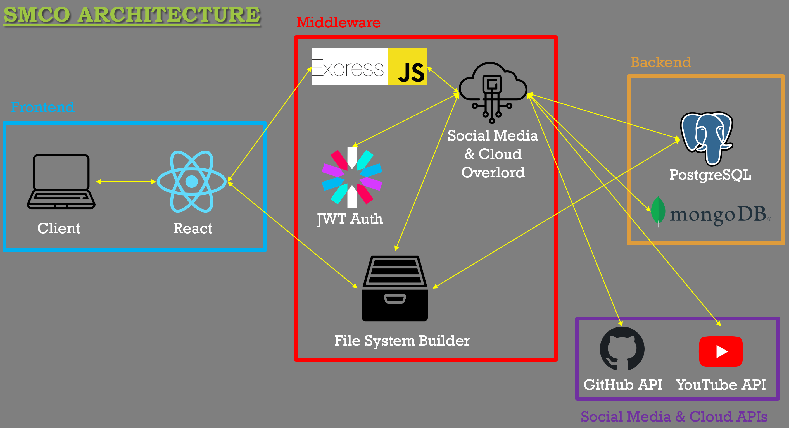

# DistributedCloudStorage

Social Media & Cloud Overlord (SMCOverlord)

A full stack cloud storage application that uses social media and cloud storage as a storage medium. With these, we can enjoy the geo-redundancy and scalability of cloud storage and social media storage, while enjoying the free storage space of social media. You have effectively an unlimited storage with this solution.

## Architecture

    

## Getting Started

Create an account, and then upload your social media API credentials to start using the application. It's that easy!

## Usage

- Social media distributor - You can now upload media you want to share in one social media platform, and it will be automatically uploaded to other social media platforms. This is useful for people who want to share their media to multiple social media platforms.
- Cloud storage - This application can be used to store some of your media and files. (Use it at your own risk as storage medium from these social media platforms are not guaranteed to be permanent.)
- Storage API - You can use our API to store your files in our application. This is useful for developers who want to store their files in our application. But we do not guarantee the permanency of the files stored in our application.

## Features

- Google Drive features such as a file system with drag and drop, move files, create folders, rename files, delete files, upload files, download files, and view files.
- Secure with JWT authentication to ensure no one can access your files except yourself.
- Forgot password feature to reset your password via your email which you registered with us.
- A intuitive credentials upload page to upload your social media & cloud API credentials.
- Recycle bin for deleted files.

## Technologies Used

1. ExpressJS

2. React

3. JWT

4. PostgreSQL

5. MongoDB

## Platforms Currently Supported

    
    

More platforms coming soon!

## How it works

### File system

The file system is implemented using a TRIE (Prefix Tree). Each directory branch can be at most 400 characters long.

Deletion of a direction uses Breadth First Search to delete all of the direction nested withing the current directory.

The file system is loaded all at once onto the client web browser. This is to ensure that the file system is fast and responsive. Moreover, the system is assumed to be file system operations intensive and that is the why we load all of the user's directory and files at all at once instead of only loading files in the current directory. Moreover, even if the user have large amount of files and folder, the loading time is reasonable enough to be acceptable.

### GitHub

Users need to get their Personal Access Token (PAT) and set it to no expiry in order to not have to manually renew the token once it expires.

Our system will then use your PAT to create a repository named "dcs_1". So when you upload something to GitHub, we will upload it to this repository. However, since there is a size limit of 50 MB per repository, we will create a new repository once the current repository is full. The new repository will be named "dcs_2", and so on. Your will also not have a name and will just be given a file ID number in the GitHub storage, we store the fileanme on our database instead.

Our system also supports multiple accounts. So, if you have multiple PAT from different accounts, we will upload your files evenly among your GitHub accounts to ensure that you can maximize your storage space. We always find the account with the least total storage used and upload your files to that account. Then we will upload that file to existing repository of that chosen account if it hasn't exceeded 50 MB even after adding our file.

### YouTube

Users need to obtain their Google OAuth for YouTube API. Then user need to upload their client secret credentials, then select their OAuth account to be redirected back to our application, then they can start using that account.

Our system supports multiple YouTube accounts, remember that one YouTube account equals 10 daily uploads (assuming the account isn't verified). So, if you have multiple YouTube accounts, we will upload your files evenly among your YouTube accounts to ensure that you can maximize your daily upload limit. We always find the account with the least daily uploads and upload your video to that account.

## Storage Service Provider Information

1. YouTube

- Only videos (with or without thumbnail)
- Unable to download as there is no API to download the videos you uploaded
- Only 10 video uploads per day for non-verified accounts
- Video title is limited to 100 characters
- Video description is limited to 5000 characters

2. GitHub

- Any type of files
- Files are all downloadable
- Each repository must be kept within 50 MB

## Future Features

1. Support for more platforms like Twitter, Facebook, Instagram, Discord, Google Drive, Dropbox, etc. Once I learn those APIs, I will add them in.

2. Support for replication of files across multiple platforms. For example, if you upload a file to GitHub, it will be can be selected to be replicated to uploaded to Google Drive as well. So that in the event when GitHub services are down, you can still access your files from Google Drive.

3. Support for intelligent platform selection for a given file, for example, small files should be uploaded to GitHub, Google Drive and videos should be uploaded to YouTube. Moreover, you should distribute the files to be uploaded evenly across all platforms. This is to ensure that you can maximize the storage space of all platforms given their daily upload limits. Files should also be upload to the most readily available platforms to prevent failure of retrieving files when needed.

4. Support for admin panel to manage the users in our system as well as to throttle users that abuse the system and to reduce our SMCOverlord server overload.

5. SMCOverlord API to allow developers to integrate our service to their application. You could use SMCOverlord to control your social media account and cloud storage or to use SMCOVerlord as a persistent storage medium. Again use it at your own risk as we do not guarantee the permanency of the files stored in our application.

## WARNING

Do not abuse the social media and cloud storage. Use it at your own risk! Admin can impose limit on your account if you abuse the social media and cloud storage.
